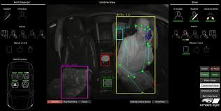

1. Summarize of the project: Design and develop an AI-based Smart cabin monitoring system for cars of Hyundai to monitor drivers and passenger's behavior, emotions,  detect seatbelt, child,... 

2. Solutions: In this system, we designed many features including seatbelt detection, human detection, hands on-hands off in the steering wheel, driver's hand gestures,... An object detection model will be used to detect seatbelt, human and hands on/off and other features will be detected by different models. All of those model will be deployed in the Texas Intruments board which will be the embedded computer in Hyundai cars
3. My position: Data scientist/ AI engineer

4. Main responsibilities:
    - Processed and managed dataset
    - Model (Edge AI YoloX) development especially applying quantize-aware training for human and seatbelt detection
    - Developed model evaluation pipeline by leveraging Prefect framework and MongoDB
    - Implemented the inference pipeline for human and seatbelt detection features

5.  Technologies and Tools used: Pytorch, Prefect, MongoDB, OpenCV
6. *Note: This is an on-going project ordered from Hyundai Mobis. Thus we cannot share the actual architecture image and the source code*

