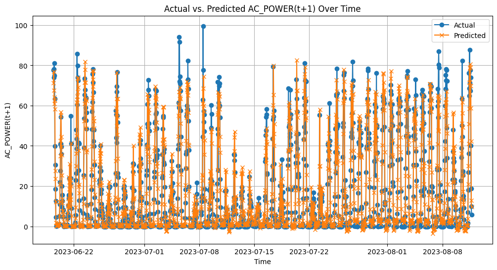

1. Summarize of the project: The solar energy system converts sunlight to electric. The inverter plays the very important role in this system. It converts Direct control (DC) electric to Alternative control (AC) electrics. Thus, a smart monitor system need to be designed to predict faults in the inverter panels and forecast the future AC power genrated based the inverter status. 

2. Solutions: 
    - For the inverter fault detector, we designed the XGBoost regressor algorithm because of the light architecture and the effificiency. The fault detector will be deployed in an edge device and attached in inverter panels to quickly detect faults.
    - For the power forecasting model, we leveraged the LSTM algorithm for better accuracy 

3. My position: Team leader

4. Main responsibilities:
    - Model (XGBoost regressor) development for the inverter fault detection task by using Scikit-learn framework
    - Implement the inference pipeline and deployed in a embedded device for inverter fault detection task
    - Code review and software design for the entire solution including power forecasting and inverter fault detection task

5.  Technologies and Tools used: Python, Scikit-learn, Docker, Pandas, Matplotlib
6. *Note: This is a project ordered from Gaesoft-a big software company in Korea. Thus we cannot share the actual architecture image and the source code*

*Power forecasting results*