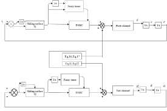

1. Summary of the project:

   Electro-optical system (EOTs) is the system used in Military to track moving objects. The important requirement of the EOTSs is that the system must be accurately pointed to a fixed or moving target even if operating in vibration environment such as ship, air plane, tank. To achieve this task is not simple because of the disturbances affecting the operating of EOTS. The disturbances affecting the operating of EOTS are the disturbance torque because of angular motion of the base body (when EOTS works in vibration environment), cross-coupling effect between the pitch and yaw channel and so on.

   In this project, I and my partner proposed and implemented some modern and efficient control algorithms such as self-tuning Fuzzy PID, self-tuning fuzzy sliding mode to help the EOTs precisely track the moving targets. 

   

   This project is the project of Vietnam Academic of Science and Technology. Thus, I cannot share the code

   You can read our publication at: https://vjs.ac.vn/index.php/jcc/article/view/12931/103810383012
2. Technologies and Programming languages used: Matlab, C++, Python, OpenCV

3. My position: Researcher

4. Main responsibilities: 
    - Researched to propose the algorithms
    - Desigined the algorithm and conducted the experiments by simulation in matlab to test the results
    - Implemented and deployed the algorithms in AVR controller-a micro controller

*Note: This is the project of Vietnamese Academeic of Science and Technology. Thus I cannot share the detail source code. Please read the paper to understand the solution*